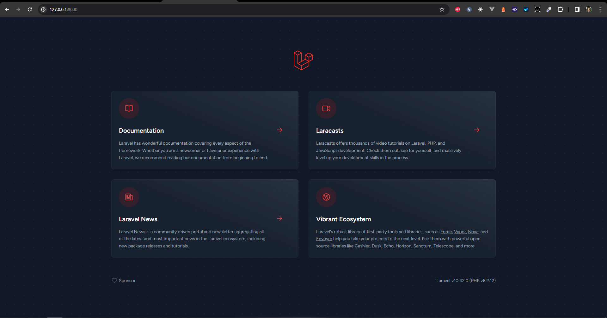

# instalação do laravel

## Passo a passo
O projeto é feito em laravel, então é necessário ter o composer instalado na máquina. Para instalar o composer, basta seguir o tutorial no site oficial do [Laravel](https://laravel.com/docs/8.x/installation).

Para iniciar um projeto em laravel, basta executar o seguinte comando no terminal:
```bash
composer create-project --prefer-dist laravel/laravel orchid
```

No meu caso, preferi a instalação global do laravel, então o comando ficou assim:
```bash
laravel new orchid
```

Após a instalação, é necessário configurar o banco de dados. Para isso, basta acessar o arquivo .env na raiz do projeto e configurar as seguintes linhas:
```bash
APP_NAME=nome_do_projeto
APP_URL=http://localhost:8000

DB_CONNECTION=mysql
DB_HOST=seu_host
DB_PORT=porta
DB_DATABASE=nome_do_banco
DB_USERNAME=usuario
DB_PASSWORD=senha
```

Após configurar o banco de dados, é necessário criar as tabelas. Para isso, basta executar o seguinte comando no terminal:
```bash
php artisan migrate
```

Para iniciar o servidor, basta executar o seguinte comando no terminal:
```bash
php artisan serve
```

Para acessar o servidor, basta acessar o seguinte endereço no navegador:
```bash
http://localhost:8000
```
## Imagem do projeto

