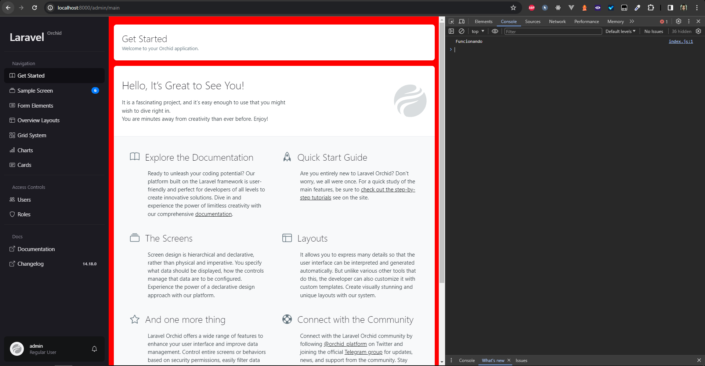

# Configurações do painel administrativo do Orchid:

## Possibilidades de configuração
- No arquivo config/platform.php, existem diversas configurações que podem ser feitas. Dentre elas, podemos destacar:
	- Configurações de domínio do painel administrativo
	- Prefixo de rota do painel administrativo
	- Adição de middleware para o painel administrativo
	- Configurações de login e autenticação
	- Página da home do painel administrativo
	- Arquivos de css e js do painel administrativo
	- Padrão de aparência do painel administrativo
	- Classes model padrão para o painel administrativo

No nosso caso, vamos somente adicionar arquivos de css e js para o painel administrativo, por hora vazios, talvez sejam utilizados no futuro. 

## Passo a passo

Para isso, vamos adicionar as seguintes linhas no arquivo config/platform.php:

```php
'resource' => [
        'stylesheets' => [
            '../css/orchid/style.css',
        ],
        'scripts'     => [
            '../js/orchid/index.js'
        ],
    ],
```

Após isso serão criados na pasta public/css/orchid e public/js/orchid os arquivos style.css e index.js, respectivamente.

Para fins de testes, vamos adicionar o seguinte conteúdo no arquivo style.css:

```css
body {
	background-color: red;
}
```

E no arquivo index.js:

```js
console.log('Funcionando!');
```

Após isso, vamos acessar o painel administrativo e verificar se os arquivos foram carregados. Para isso, vamos acessar a url http://localhost:8000/dashboard e verificar se o background da página está vermelho e se no console do navegador aparece a mensagem "Funcionando!".

## Imagem do projeto

