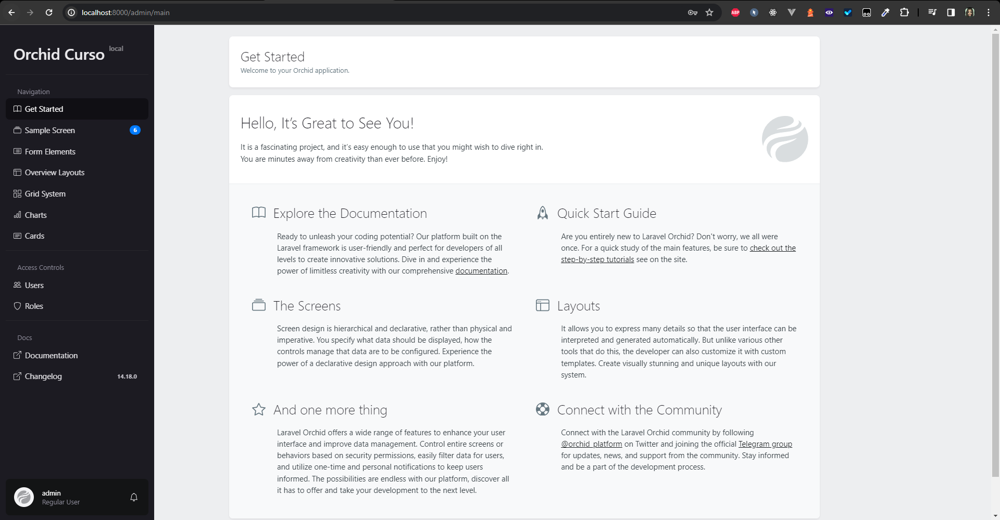
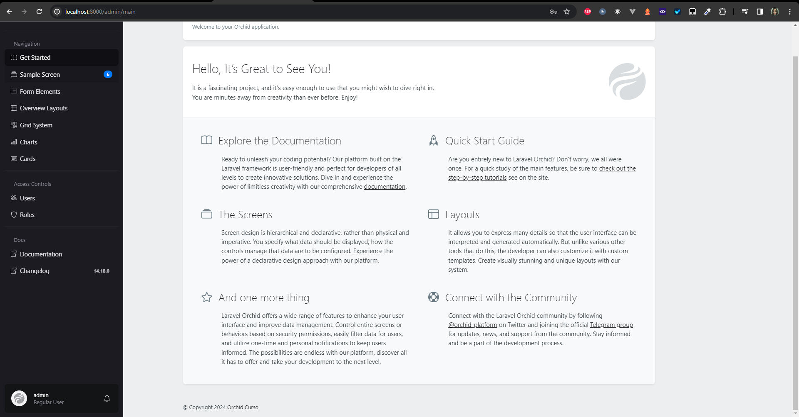

# Branding

## Conceitos

### O que é Branding?

O Branding é que a gestão de uma marca. É o processo de construção de uma marca, desde a criação do nome, identidade visual, posicionamento, até a forma como ela se relaciona com o público.

No caso do orchild, o branding nada mais é que definir uma identidade visual para o painel administrativo.

## Passo a passo

Para definir a identidade visual do painel administrativo, vamos seguir os seguintes passos:

1. Definir o nome da marca: orchild
2. Definir o logotipo: orchild

No orchid o branding pode alterar css, javascript, header e footer do painel administrativo. Por hora só vamos alterar o header e footer.

### Alterando o header

Para alterar o header, vamos criar um arquivo chamado `header.blade.php` dentro da pasta `/resources/views/brand/`.

```php
<!-- resources/views/brand/header.blade.php -->
	@push('head')
    <link
        href="/favicon.ico"
        id="favicon"
        rel="icon"
		>
	@endpush

	<div class="h2 d-flex align-items-center">
		@auth
			<x-orchid-icon path="bs.house" class="d-inline d-xl-none"/>
		@endauth

		<p class="my-0 {{ auth()->check() ? 'd-none d-xl-block' : '' }}">
			{{ config('app.name') }}
			<small class="align-top opacity">{{ config('app.env') }}</small>
		</p>
	</div>
```

PS: Você pode alterá-lo como quiser.

### Alterando o footer

Para alterar o footer, vamos criar um arquivo chamado `footer.blade.php` dentro da pasta `/resources/views/brand/`.

```php
<!-- resources/views/brand/footer.blade.php -->
<p class="small m-n">
    © Copyright {{date('Y')}} 
    <a href="{{ config('app.url') }}" target="_blank">
        {{ config('app.name') }}
    </a>
</p>
```

PS: Você pode alterá-lo como quiser.

Neste ponto, você perceberá que nada mudou no painel administrativo. Isso acontece porque o orchid não sabe que você criou um branding. Para que ele saiba, você precisa informá-lo.

### Informando o branding

Para informar o branding, vamos criar acessar o arquivo `config/platform.php` previamente criado pelo orchid, nele vamos alterar o código abaixo:

No arquivo `config/platform.php` o código deve estar assim:

```php
'template' => [
    'header' => null,
    'footer' => null,
],
```

Devemos alterá-lo para:

```php
'template' => [
	'header' => 'brand.header',
	'footer' => 'brand.footer',
],
```

Está pronto! Agora você pode acessar o painel administrativo e verá que o header e footer foram alterados.

## Imagens

### Imagem 1 - Header



### Imagem 2 - Footer

