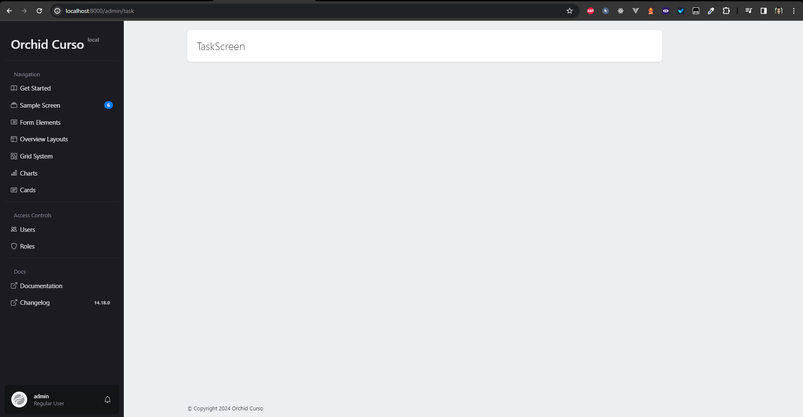
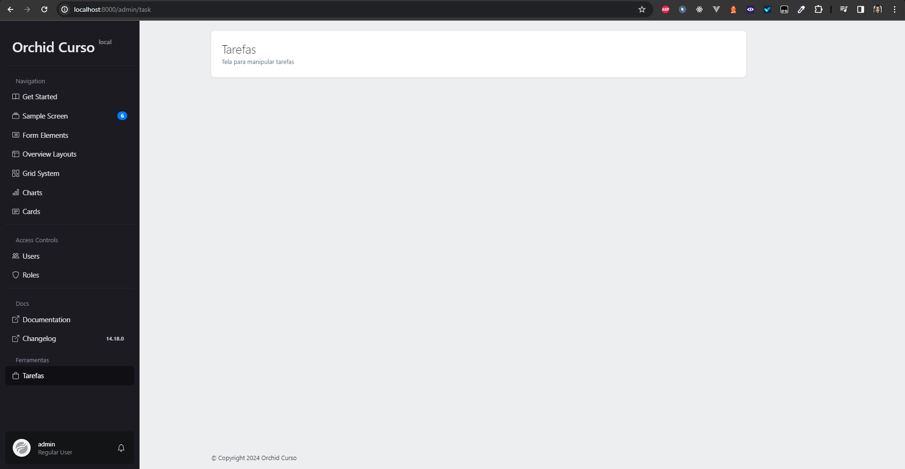
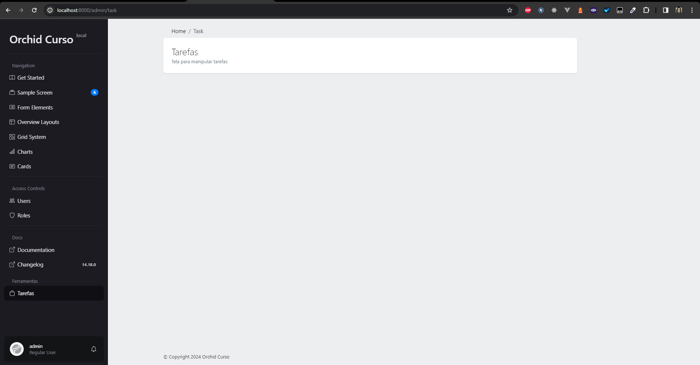
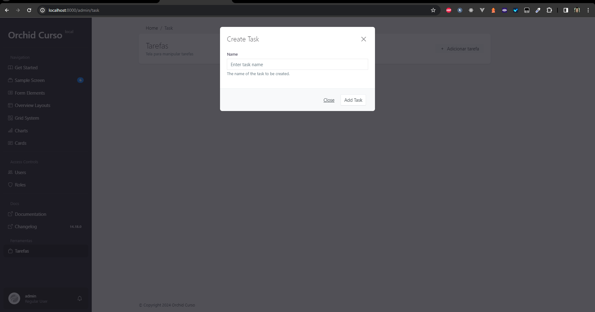
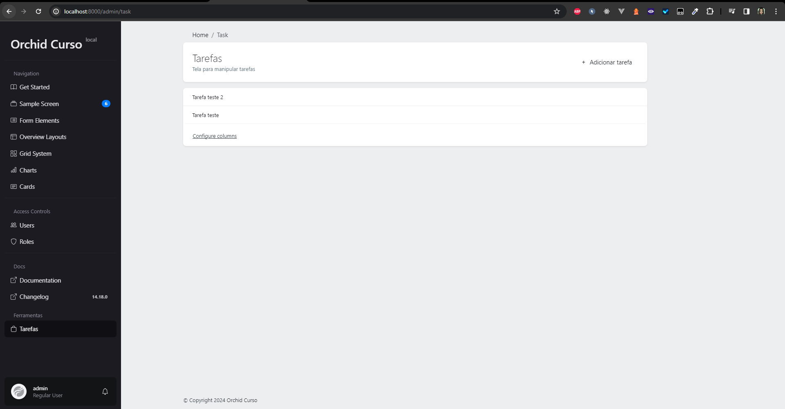
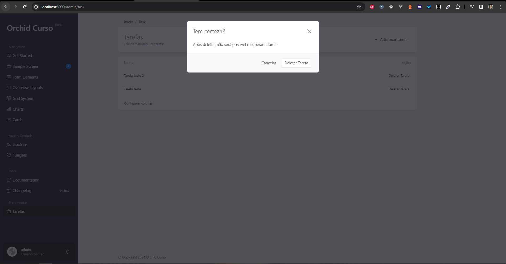

# Início Rápido

## Preparando o banco de dados

### Criando Migration
Para preparar o banco de dados, que já foi configurado anteriormente, iremos criar uma migration. No nosso caso, será uma migration de tarefas (tasks). Para criar a migration, execute o comando:

```bash
php artisan make:migration create_tasks_table --create=tasks
```

Agora iremos editar a migration recém-criada e adicionar os campos necessários. a migration se encontra em `database/migrations/[timestamp]_create_tasks_table.php`. Abra o e onde se encontra o método `up`, modifique o método para que fique da seguinte forma:

```php
public function up()
    {
        Schema::create('tasks', function (Blueprint $table) {
            $table->id();
            $table->string('name');
            $table->boolean('active')->default(1);
            $table->timestamps();
        });
    }
```

O método down deve ficar da seguinte forma:

```php
public function down()
    {
        Schema::dropIfExists('tasks');
    }
```

Agora, execute o comando para criar a tabela no banco de dados:

```bash
php artisan migrate
```

### Criando Model

Agora que a tabela foi criada no banco de dados, iremos criar um model para a tabela. Execute o comando:

```bash
php artisan make:model Task
```

Após isso, abra o arquivo `app/Modes/Task.php` e adicione o atributo `$fillable`:

```php
class Task extends Model
{
    protected $fillable = ['name', 'active'];
}
```

Além disso, para que o orchid consiga manipular a tabela, é necessário adicionar à model a trait `Orchid\Screen\AsSource`. Também adicionaremos a trait `HasFactory` para que possamos criar registros de teste no banco de dados. A model ficará da seguinte forma:

```php
class Task extends Model
{
    use AsSource, HasFactory;

    protected $fillable = ['name', 'active'];
}
```

### Criando Screen

Agora que a migration e o model foram criados, iremos criar uma tela para manipular os registros da tabela. Para isso, execute o comando:

```bash
php artisan orchid:screen TaskScreen
```

Um novo arquivo será criado em `app/Orchid/Screens/TaskScreen.php`.

### Criando Route

Antes de prossguir, é necessário que saiba que o orchid não utiliza o arquivo `web.php` para criar rotas. Ao invés disso, ele utiliza o arquivo `routes/platform.php`. Abra o arquivo `routes/platform.php` e adicione a seguinte rota:

```php
/*Importação da screen*/
use App\Orchid\Screens\TaskScreen;

/* Nova rota */
Route::screen('task', TaskScreen::class)->name('platform.task');
```

Agora que a rota foi criada, é possível acessar a tela de tarefas no painel administrativo pela rota `http://localhost:8000/admin/task`.

A tela deve aparecer da seguinte forma:


Como pode observar, a tela já está pronta para manipular os registros da tabela. No entanto, neste momento não há nada.

Agora que criamos a rota, iremos acessar o arquivo `app/Orchid/Screens/TaskScreen.php` e mudar o nome da tela para "Tarefas". Para isso a função:

```php
public function name(): ?string
{
    return 'Simple To-Do List';
}
```

Deve ser modificada para:

```php
public function name(): ?string
{
    return 'Tarefas';
}
```

Além disso, adicionaremos uma descrição para a tela. Para isso, a função:

```php
public function description(): ?string
{
    return 'Tela para manipular tarefas';
}
```

Você pode adicionar onde achar intuitivo, no meu caso, optei por adicionar logo abaixo da função `name`.

A tela agora pode ser acessada e deve ficar assim:


### Navegação

Para facilitar a navegação, é possível adicionar a tela de tarefas ao menu do painel administrativo. Para isso, acesse o arquivo `app/Orchid/PlatformProvider.php`. Você deve encontrar uma função chamada `menu`. Aqui deve ser adicionada a sua rota. No meu caso, adicionei a seguinte linha:

```php
Menu::make('Tarefas') /* Nome do menu */
    ->icon('bag') /* Ícone pode ser alterado */
    ->route('platform.task') /* Rota da tela */
    ->title('Ferramentas'), /* Título do menu */
```

Você pode adicionar onde preferir, no meu caso, adicionei abaixo de absolutamente tudo. A tela de tarefas agora pode ser acessada diretamente pelo menu do painel administrativo:



### Criando BreadCrumbs

Para adicionar um breadcrumb à tela, é necessário acessar o arquivo o arquivo de rotas `routes/platform.php`. Após acessar, procure a rota que foi criada para a tela de tarefas. No meu caso, a rota é a seguinte:

```php
Route::screen('task', TaskScreen::class)->name('platform.task');
```

Adicione à ela o método breadcrumbs. No meu caso, a rota ficou da seguinte forma:

```php
Route::screen('task', TaskScreen::class)
	->name('platform.task')
	->breadcrumbs(function (Trail $trail){
        return $trail
            ->parent('platform.index')
            ->push('Task');
    });
```

Agora, ao acessar a tela de tarefas, um breadcrumb será exibido no topo da tela:


## Adicionando Tarefas

### Criando Modal

Uma forma de adicionar tarefas é através de um modal. Para isso, iremos criar um modal para adicionar tarefas. Para isso, é necessárioa cessar o arquivo `app/Orchid/Screens/TaskScreen.php` e no método layout, adicionar o seguinte código:

```php
Layout::modal('taskModal', Layout::rows([
            Input::make('task.name')
                ->title('Name')
                ->placeholder('Enter task name')
                ->help('The name of the task to be created.'),
        ]))
            ->title('Create Task')
            ->applyButton('Add Task'),
```

deve ficar da seguinte forma:

```php
/* Importações */
use Orchid\Screen\Fields\Input;
use Orchid\Support\Facades\Layout;

/* Método layout */	
public function layout(): iterable
{
    return [
        Layout::modal('taskModal', Layout::rows([
            Input::make('task.name')
                ->title('Name')
                ->placeholder('Enter task name')
                ->help('The name of the task to be created.'),
        ]))
            ->title('Create Task')
            ->applyButton('Add Task'),
    ];
}
```

### Lançando o modal

Caso tente acessar a tela de tarefas, verá que o modal não aparece. Isso acontece porque o modal não foi lançado. Para lançar o modal, iremos adicionar um botão à command bar. Para isso, acesse o arquivo `app/Orchid/Screens/TaskScreen.php` e adicione o seguinte código ao método `commandBar`:
```php
ModalToggle::make('Add Task')
	->modal('taskModal')
	->method('create')
	->icon('plus'),
```

O método `commandBar` deve ficar da seguinte forma:

```php
/* Importações */
use Orchid\Screen\Actions\ModalToggle;

/* Método commandBar */
public function commandBar(): iterable
{
    return [
        ModalToggle::make('Add Task')
            ->modal('taskModal')
            ->method('create')
            ->icon('plus'),
    ];
}
```

** Method ** é o método que será chamado ao clicar no botão. No nosso caso, o método é o `create`. O método `create` será criado mais adiante.

Agora, ao acessar a tela de tarefas, um botão para adicionar tarefas deve aparecer na command bar. Ao clicar no botão, o modal deve aparecer:



É importante ressaltar que o modal não faz nada ainda. Para que o modal funcione, é necessário setar o método que salvará a tarefa.

### Salvando Tarefas

Para salvar os dados, é necessário criar um método no arquivo `app/Orchid/Screens/TaskScreen.php`. O método deve ser chamado `create` e deve receber um parâmetro do tipo `Request`. Usando a documentação do Orchid, o nome padrão do método é `create`. Usaremos o padrão para facilitar a compreensão. O método deve ser criado da seguinte forma:

```php
/* Importações */
use App\Models\Task;
use Illuminate\Http\Request;

/* Método create */
public function create(Request $request)
{
    /* Validação dos dados */
    $request->validate([
        'task.name' => 'required|max:255',
    ]);

	/* Salvando a tarefa */
    $task = new Task();
    $task->name = $request->input('task.name');
    $task->save();
}
```

Recomendo dar um dd() para entender o que está acontecendo.

Agora sim, ao adicionar uma tarefa, ela será salva no banco de dados. Caso queira tentar, fique à vontade. Salve e verifique no seu banco de dados se a tarefa foi salva.

### Mostrando Tarefas

Como puderam verificar, os dados estão sendo salvas no banco de dados, mas não estão sendo mostrados na tela. Para mostrar os dados, é necessário acessar o arquivo `app/Orchid/Screens/TaskScreen.php` e no método query, referenciar a model que será utilizada. No meu caso, a model é a `Task`. O método deve ser modificado da seguinte forma:

```php
/* Importações */
use App\Models\Task; /* Provavelmente já está importado antes, verifique para evitar erros */

/* Método query */
public function query(): array
{
	return [
		'tasks' => Task::latest()->get(), // Retorna todas as tarefas em ordem decrescente
	];
}
```

Agora que os dados estão sendo retornados, é necessário mostrar os dados na tela. Para isso, é necessário acessar o arquivo `app/Orchid/Screens/TaskScreen.php` e no método layout, adicionar o seguinte código:

```php
Layout::table('tasks', [
		TD::make('name'),
	]),
```

Você pode adicionar onde achar melhor, no meu caso, adicionei acima do modal. O método `layout` deve ficar da seguinte forma:

```php
/* Importações */
use Orchid\Screen\TD;

public function layout(): iterable
{
    return [
        Layout::table('tasks', [
            TD::make('name'),
        ]),

        Layout::modal('taskModal', Layout::rows([
            Input::make('task.name')
                ->title('Name')
                ->placeholder('Enter task name')
                ->help('The name of the task to be created.'),
        ]))
            ->title('Create Task')
            ->applyButton('Add Task'),
    ];
}
```

Agora, ao acessar a tela de tarefas, as tarefas devem aparecer na tela:



### Adicionando Botão de Delete

Agora que as tarefas estão sendo mostradas na tela, é possível adicionar um botão para deletar as tarefas. Para isso, é necessário acessar o arquivo `app/Orchid/Screens/TaskScreen.php` e no método layout, adicionar o seguinte código:

```php
/* Importações */
use Orchid\Screen\Actions\Button;

/* Método layout */
Layout::table('tasks', [
    TD::make('name'),

    TD::make('Actions')
        ->alignRight()
        ->render(function (Task $task) {
            return Button::make('Delete Task')
                ->confirm('After deleting, the task will be gone forever.')
                ->method('delete', ['task' => $task->id]);
        }),
]),
```

Seu método `layout` deve ficar da seguinte forma:

```php
/* Importações */
use Orchid\Screen\Actions\Button;

/* Método layout */
public function layout(): iterable
    {
        return [
            Layout::table('tasks', [
                TD::make('name'),

                TD::make('Ações')
                ->alignRight()
                ->render(function (Task $task) {
                    return Button::make('Deletar Tarefa')
                        ->confirm('Após deletar, não será possível recuperar a tarefa.')
                        ->method('delete', ['task' => $task->id]);
                }),
            ]),

            Layout::modal('taskModal', Layout::rows([
                Input::make('task.name')
                    ->title('Nome')
                    ->placeholder('Digite o nome da tarefa aqui.')
                    ->help('O nome da tarefa a ser criada.'),
            ]))
                ->title('Criar Tarefa')
                ->applyButton('Adicionar Tarefa'),
        ];
    }
```

** Method ** é o método que será chamado ao clicar no botão. No nosso caso, o método é o `delete`. O método `delete` será criado mais adiante.

### Deletando Tarefas

Para deletar as tarefas, é necessário criar um método no arquivo `app/Orchid/Screens/TaskScreen.php`. O método deve ser chamado `delete` e deve receber um parâmetro do tipo `Request`. Usando a documentação do Orchid, o nome padrão do método é `delete`. Usaremos o padrão para facilitar a compreensão. O método deve ser criado da seguinte forma:

```php
public function delete(Task $task)
{
    $task->delete();
}
```

Agora ao clicar em "Deletar Tarefa", abrirá um modal de confirmação. Ao clicar em "Deletar", a tarefa será deletada. Deve ficar assim:

