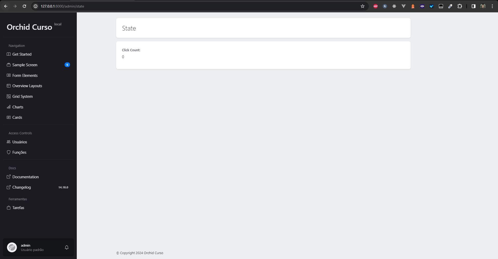
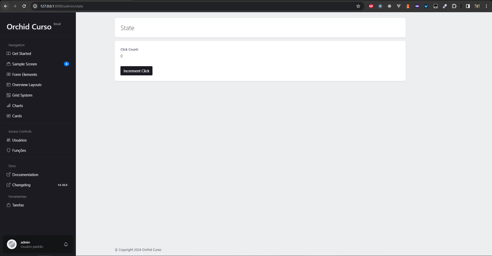

# Gerenciamento de Estado

## Introdução

O gerenciamento de estado nada mais é do que a forma como a aplicação lida com os dados que ela possui armazenadas, no caso do orchid, como ela lida com pequenos dados, que não foram armazenados no banco de dados. Por exemplo, o estado, quando acontece uma transição de tela, ou um formulário que foi preenchido, mas ainda não foi enviado.

## Armazenando uma quantidade pequena de dados

Para um melhor entendimento prático, seguindo a documentação do orchid, vamos criar um contador de cliques, que irá armazenar a quantidade de cliques que um botão recebeu em tempo de execução, ou seja, não é salvo no banco de dados e quando a página é recarregada, o contador é zerado.

### Criando uma nova screen

Para criar uma nova screen no orchid, basta rodar no prompt de comando o seguinte comando:

```bash
php artisan orchid:screen StateScreen
```

### Registrando a nova screen

Como visto anteriormente, para registrar uma nova screen no arquivo de rotas, basta adicionar a seguinte linha de código no arquivo `routes/platform.php`:

```php
// Importação
use App\Orchid\Screens\StateScreen;

// Código
Route::screen('state', StateScreen::class)->name('state');
```

Agora, ao acessar a rota `http://localhost:8000/admin/state`, que no momento não tem nada de mais, apenas o padrão do orchid.

### Contando os cliques

Para contar os cliques, vamos adicionar um contador na nossa screen. Para isso, vamos abrir o arquivo `app/Orchid/Screens/StateScreen.php`. Primeiro, no método `query`, vamos criar um novo campo chamado `clicks`, que irá armazenar a quantidade de cliques que o botão recebeu. O código ficará assim:

```php
public function query(): array
	{
		return [
			'clicks' => 0,
		];
	}
```

Vamos renomear a screen de `StateScreen` para `State`, para isso, vamos alterar o método `name` para `State`:

```php
public function name(): string
	{
		return 'State';
	}
```

Agora, no campo layout, vamos adicionar uma label com título `Clicks`: 

```php
// Importação

use Orchid\Screen\Fields\Label;
use Orchid\Support\Facades\Layout;

// Código
 public function layout(): array
    {
        return [
            Layout::rows([
                Label::make('clicks')->title('Click Count:'),
            ]),
        ];
    }
```

Abrindo a screen no navegador, ele deve ficar assim:



### Adicionando um botão para incrementar o contador

Para adicionar um botão que incrementa o contador, vamos adicionar um botão no método `layout`:

```php
// Importação

use Orchid\Support\Color;
use Orchid\Screen\Actions\Button;

// Código
public function layout(): array
{
    return [
        Layout::rows([
            Label::make('clicks')
                ->title('Click Count:'),

            Button::make('Aumentar Clicks')
                ->type(Color::DARK)
                ->method('increment'),
        ]),
    ];
}
```

Explorando o código, estamos adicionando ao layout um botão (Button) com o título `Aumentar Clicks`, com a cor `DARK` do bootstrap, e o botão ao ser clicado, irá chamar o método `increment`, que vamos criar agora, mas para fins de teste, vamos apenas dar um `dd` nos dados e ver o que o botão irá receber. O código do método `increment` ficará assim:

```php
// Importação
use Illuminate\Http\Request;

// Código
public function increment(Request $request)
{
    dd($request->all());
}
```

Sua screen deve ficar assim:



Ao clicar no botão, ele irá mostrar um `array` com os dados que foram enviados. Deve mostrar algo assim:

```php
array:1 [▼ // app\Orchid\Screens\StateScreen.php:67
  "_token" => "HWA7dnqcyczgq26qmNJGBYFV0Q7HkoRU4OZYP87I"
]
```

Neste ponto, irá notar que o valor de `clicks` não está sendo enviado. Para isso, o orchid possui uma solução conveniente que salva o estado de atributos públicos da classe. Para isso, basta adicionar o atributo `public $clicks;` no início da classe, e no método `increment`, vamos dar um "dd" no valor de `clicks`:

```php
public $clicks;

public function increment(Request $request)
{
	dd($this->clicks);
}
```

Agora ao clicar no botão, essa deve ser a saída:

```php
0 // app\Orchid\Screens\StateScreen.php:68
```

### Incrementando o contador

Agora que sabemos que o valor de `clicks` está sendo salvo, antes de realmente incrementar o valor, é necessário que, no método `query`, a chave `clicks` referencie o atributo `clicks` da classe, mas é importante lembrar que o valor de `clicks` inicialmente é `null`, então é necessário adicionar um valor padrão para ele. O método `query` ficará assim:

```php
public function query(): array
{
	return [
		'clicks' => $this->clicks ?? 0,
	];
}
```

Após isso, no método `increment`, vamos incrementar o valor de `clicks`, ficará assim:

```php
public function increment(Request $request)
{
	$this->clicks++;
}
```

Agora, ao clicar no botão, o valor de `clicks` deve ser incrementado. Está pronto o contador de cliques.